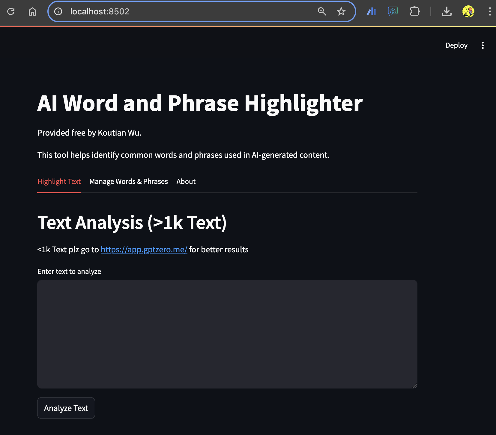
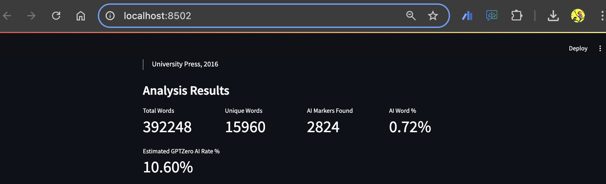
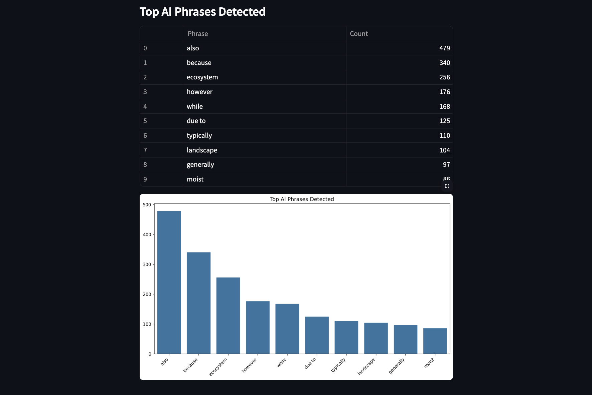

# AI-Text-Highlighter
---
Author: Koutian Wu

Github, LinkedIn: ktwu01

Release date: Apr 20, 2025

---

The AI Word and Phrase Highlighter is designed to detect common words and phrases frequently used in AI-generated content.

为啥要做：，优势

免费开源。

本地部署，数据不上传，隐私保护。

可以根据需要自定义AI词库。

某种意义上也可以作为违禁词词库查询。。

捐赠选项，捐赠支持作者。


## How It Works

The tools work by scanning text for words and phrases commonly used by AI models like ChatGPT, Claude, and others. These words and phrases are ranked based on their frequency in AI-generated documents compared to human-written documents. The data is drawn from research by various detection tools like ZeroGPT and GPTZero.

When analyzing text, the tools identify common AI markers like:
- Overused transition phrases ("Furthermore", "On the other hand")
- Formal academic constructions ("It's important to note", "In conclusion")
- Verbose expressions ("When it comes to", "In the realm of")
- Distinctive vocabulary ("delve", "plethora", "harness", "tapestry")

## Using the Tools

You can use these tools in several ways:

1. **For Content Creation**: Identify and replace AI-like patterns in your writing
2. **For SEO**: Optimize content to reduce AI detection probability
3. **For Education**: Compare AI vs. human writing patterns
4. **For Research**: Analyze large text corpora for AI indicators

The HTML reports provide color-coded highlighting of AI indicators and suggest alternative words and phrases to make text appear more human-written.

## Installation & Setup

To use these tools:

1. Git Clone
   ```
   git clone https://github.com/ktwu01/AI-Text-Detector.git
   ```
2. Install required dependencies:
   ```
   pip install pandas matplotlib seaborn streamlit sqlite3
   ```
3. Run the tool
 <!-- according to your needs:
   - For the Streamlit app:  -->
   ```
   streamlit run KW-ai_word_highlighter.py
   ```
   
<!-- 
   - For command-line analysis: 
   ```
   python ai_seo_analyzer.py --file your_text.txt
   ```
   
   - For Python integration: Import SimpleAIWordHighlighter in your code -->

## Preview


Example result:




